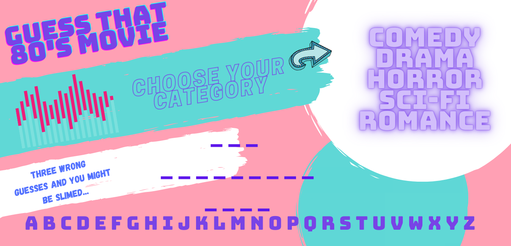

# Project 1 - Guess That 80s Movie!

<h3> Ah, the 80s. </h3>

<h4>You had to be there. The technologies! The culture! The nuclear threats!</h4>

<h4>Come and join me as we make our way back to the era that literally defined Sophia Coppola's incredibly profitable aesthetic.</h4>

Get a chance to jog that space in your precious memories reserved only for the things that brought you the most joy: 80s movies.

We'll try to make things stylish and pretty, but hey, the 80s were the dawn of the PC so you'll get what we give you and that may be just enough to get things working!

Upon loading, you'll be provided with a set of blank spaces and you'll have to guess the name of the movie by clicking the letters that you think make up that title.

Guess the wrong letter 4 times and you may get...er...a surprise. Not as good as tasty as a HI-C but perhaps just as sticky.

Figure out the movie title and you'll get what every child who was born in the 80s craves to this day - validation!

If you want to play again, find the wise words of John McClane and click to play again!

<h3>Technologies Used</h3>
<ul>
<li>HTML</li>
<li>CSS</li>
<li>JS</li>
<ul>

<h3>Iterations</h3>
<ul>
<li>Version 1.1 - Working hangman with interactive category options including, comedy, drama, romance, and horror that the user is able to select and have at least 2 or 3 titles within those categories</li>
<li>Version 1.2 - A button to generate hints for each movie.</li>
<ul>
